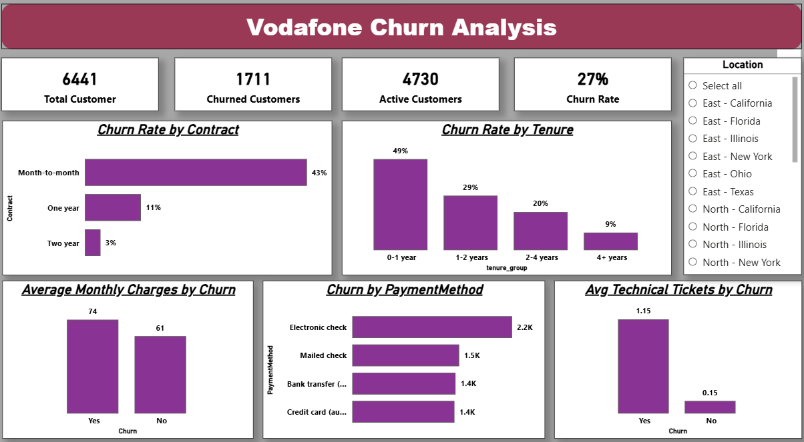

# customer-churn-analysis
End-to-end customer churn analysis using MySQL and Power BI

# 📌 Project Overview

Customer churn is a critical challenge for subscription-based businesses, as losing existing customers directly impacts revenue and growth.

This project focuses on analyzing Vodafone’s customer churn dataset to identify key drivers of attrition and provide data-driven insights that support customer retention strategies in the telecommunications domain.

The analysis was conducted using MySQL for data preparation and analysis and Power BI for visualization, following an end-to-end analytics workflow.

# 🎯 Business Objective

- Understand why customers churn
- Identify high-risk customer segments
- Analyze churn across contracts, tenure, billing, payment methods, and support interactions
- Present insights through a single-page executive dashboard

# 🛠 Tools & Technologies

- MySQL – Data cleaning, feature engineering, EDA, and business analysis
- Power BI – Interactive dashboard and KPI visualization
- GitHub – Project version control and documentation

# 📂 Dataset Overview
The dataset used in this project is based on Vodafone customer subscription and service usage data, containing demographic, billing, service, and support-related information.

- Total Records: 6,441 customers  
- Initial Columns: 23  
- Derived Columns: 2 (`churn_flag`, `tenure_group`)

Key Data Categories:
  - Customer demographics
  - Service usage details
  - Contract and billing information
  - Payment methods
  - Customer support interactions
  - Churn status (target variable)

# 🧹 Data Preparation & Feature Engineering

Key steps performed:
- Standardized categorical columns and handled blank values
- Validated data integrity (duplicates, missing values)
- Created a binary churn flag for numerical analysis
- Grouped customer tenure into meaningful lifecycle stages

# 📊 Exploratory & Business Analysis

The analysis focused on understanding churn patterns across:
- Contract type
- Customer tenure
- Billing behavior
- Payment methods
- Technical support interactions
- Geographic regions

# 🔑 Key Insights

- Month-to-month contracts show significantly higher churn compared to long-term contracts
- Early-tenure customers (0–1 year) have the highest churn rate (~49%)
- Customers with higher monthly charges tend to churn earlier
- Electronic check users show higher churn than automatic payment users
- Churned customers raise more technical support tickets, indicating service quality issues

# 📈 Power BI Dashboard
The final insights were consolidated into a single-page executive dashboard that provides:
- Overall churn KPIs
- Key churn drivers across customer segments
- Interactive filtering by location

# 📸 Dashboard Preview:

# 💡 Business Recommendations

- Improve onboarding and engagement for new customers
- Incentivize customers to move to long-term contracts
- Review pricing strategies for high monthly charge customers
- Encourage automatic payment methods
- Enhance technical support quality to reduce churn

